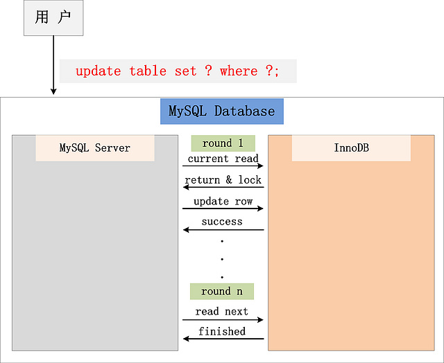

## Isolation

* **Read Uncommited**

可以读取未提交记录。此隔离级别，不会使用，忽略。

* **Read Committed (RC)**

快照读忽略，本文不考虑。针对当前读，**RC隔离级别保证对读取到的记录加锁 (记录锁)**，存在幻读现象。

* **Repeatable Read (RR)**

快照读忽略，本文不考虑。

针对当前读，**RR隔离级别保证对读取到的记录加锁 (记录锁)，同时保证对读取的范围加锁，新的满足查询条件的记录不能够插入 (间隙锁)**，不存在幻读现象。InnoDB默认级别。

* **Serializable**

从MVCC并发控制退化为基于锁的并发控制。不区别快照读与当前读，所有的读操作均为当前读，读加读锁 (S锁)，写加写锁 (X锁)。

#MVCC--Multi-Version Concurrency Control 多版本并发控制

快照读 (snapshot read,基本select)与当前读 (current read,特殊读，插入/更新/删除）

更新流程:

从图中，可以看到，一个Update操作的具体流程。当Update SQL被发给MySQL后，MySQL Server会根据where条件，读取第一条满足条件的记录，然后InnoDB引擎会将第一条记录返回，并加锁 (current read)。待MySQL Server收到这条加锁的记录之后，会再发起一个Update请求，更新这条记录。一条记录操作完成，再读取下一条记录，直至没有满足条件的记录为止。因此，Update操作内部，就包含了一个当前读。同理，Delete操作也一样。Insert操作会稍微有些不同，简单来说，就是Insert操作可能会触发Unique Key的冲突检查，也会进行一个当前读

## Lock(innodb 5.7)

* Shared and Exclusive Locks(S,X)

* Intention Locks

申请意向锁的动作是数据库完成的，事务A申请一行的行锁的时候，数据库会自动先开始申请表的意向锁

* Record Locks

* Gap Locks

解决幻读

* Next-Key Locks

record+gap

* Insert Intention Locks

* Auto-INC Locks

*  Predicate Locks for Spatial Indexes
