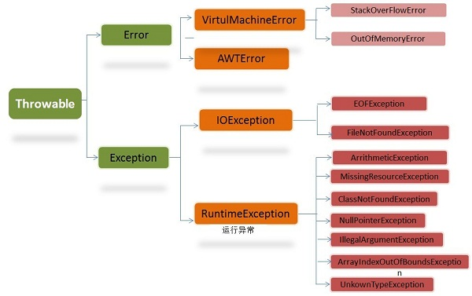

 通常，Java的异常(包括Exception和Error)分为可查的异常（checked exceptions）和不可查的异常（unchecked exceptions）。
 ### 可查异常（编译器要求必须处置的异常):
 正确的程序在运行中，很容易出现的、情理可容的异常状况。可查异常虽然是异常状况，但在一定程度上它的发生是可以预计的，而且一旦发生这种异常状况，就必须采取某种方式进行处理。
 除了RuntimeException及其子类以外，其他的Exception类及其子类都属于可查异常。这种异常的特点是Java编译器会检查它，也就是说，当程序中可能出现这类异常，要么用try-catch语句捕获它，要么用throws子句声明抛出它，否则编译不会通过。

 ## 不可查异常(编译器不要求强制处置的异常):包括运行时异常（RuntimeException与其子类）和错误（Error）。

  Exception 这种异常分两大类运行时异常和非运行时异常(编译异常)。程序中应当尽可能去处理这些异常。

  - 运行时异常：都是RuntimeException类及其子类异常，如NullPointerException(空指针异常)、IndexOutOfBoundsException(下标越界异常)等，这些异常是不检查异常，程序中可以选择捕获处理，也可以不处理。这些异常一般是由程序逻辑错误引起的，程序应该从逻辑角度尽可能避免这类异常的发生。

  - 运行时异常的特点是Java编译器不会检查它，也就是说，当程序中可能出现这类异常，即使没有用try-catch语句捕获它，也没有用throws子句声明抛出它，也会编译通过。
  - 非运行时异常 （编译异常）：是RuntimeException以外的异常，类型上都属于Exception类及其子类。从程序语法角度讲是必须进行处理的异常，如果不处理，程序就不能编译通过。如IOException、SQLException等以及用户自定义的Exception异常，一般情况下不自定义检查异常。
