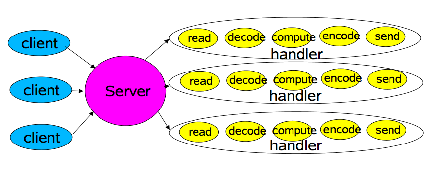
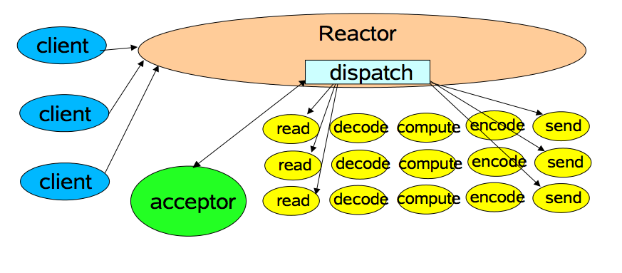
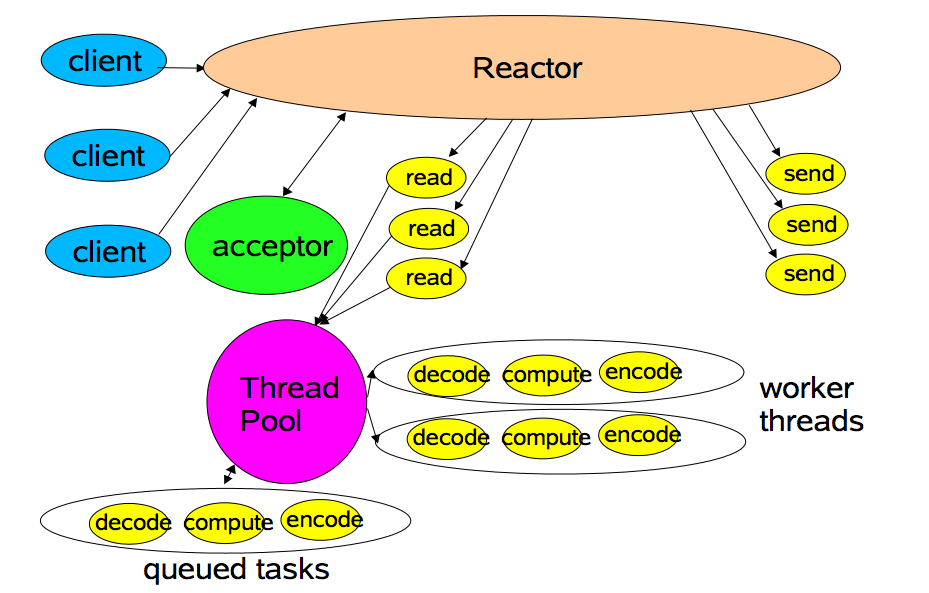
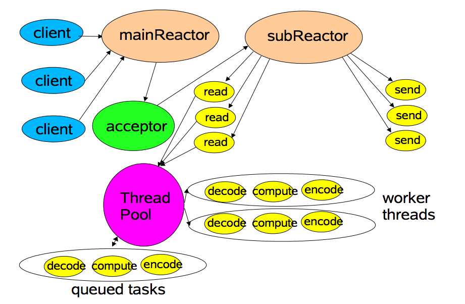

## concept

#### io
- classic
  
  *******
- base-reactor
  
  ******
- worker-threadpool-reactor
  
*****
- multiple-reactor
    

-
*******
#### nio
- 以前的流（水管没有水龙头），伸手接水，水来或者不来，你需要等着，线程阻塞；
- nio 加了Channel，相当于加了水龙头，虽然同一时间只能接一个水管的水，但是依赖轮询，在水量不大的时候，各个水管流出来的水都可以接到，关键就在于增加了接水工，也就是selector，它负责协调，也就是看看那个水管有水了，在当前水管的水接到一定程度的时候，就切换一下：临时关上水龙头，尝试打开例外一个水龙头（看看有没有水）。当其它人需要水的时候，不是直接去接水，而是提前给了水工一个水桶（buffer），水满了会通知他们；也是就是说，需要水的人可能也要等，不过不会再现场等，而是回家等，可以做其他的事情；
#### aio
#### netty
#### mina
