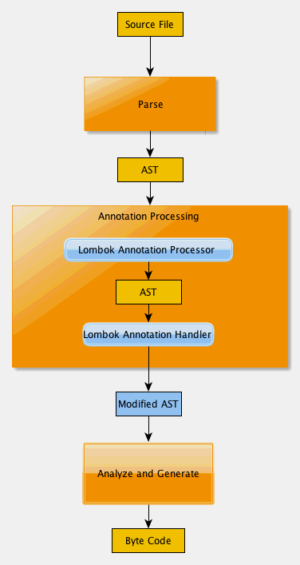

## Lombok
- 原理
  - 编译过程图解：

      
- 编译描述：
  - 编译：
    - .java -> .class {javac,ecj(eclipse jdt)}
    - JIT(just in time compiler):字节码->机器码 {hotspot c1 c2}
    - AOT(ahead of time compiler):.java->机器码 {GNU Compiler for the  java(GCJ)}
- 
