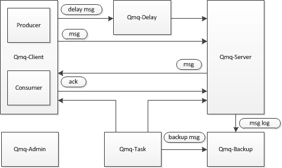

## 架构

### client
最开始时，MessageConsumerProvider这个Bean的初始化：

1. 执行init(),包括QmqConsumer的注册信息
2. new一个MessageDistributor分发器
3. 执行export()，建立一个consumer端与server端的直连dubbo，consumer提供一个接口，接口中需要实现handle和qunarMeassageState方法

4. 检查业务是否开启了healthcheck.html的上下线机制；开启了qmq就用这个机制来控制上下线；没有则一订阅就上线

然后，spring在扫描指定包中的@QmqConsumer注解时，会：

1. 注册一个ConsumerAnnotationScanner注解扫描器

2. 它会在扫到注解时，执行parseMethods方法，逐个遍历检查注解标记的Method

3. 校验参数是否只有一个且为Message类型的参数；校验是否提供prefix，用于订阅的主题

4. 向MessageDistributor里添加一个listener；其中会把key=主题+分组，value=对应的handler解析器放到一个map中

最后，当provider把消息发给server时；

1. server会主动调用consumer提供的handle方法把Message推送过来

2. 将内容的prefix+group组成key，从map中找到对应的handler解析器，执行对应的handle方法

3. 判断队列中是否有重复消息，没有的话放到线程中；consumer的线程会执行onMessage方法

4. 即执行相应的@QmqConsumer所标注的方法，执行业务逻辑完毕后

5. 会执行一个ack方法，向broker发送一个ack标志自己消费了这个消息
