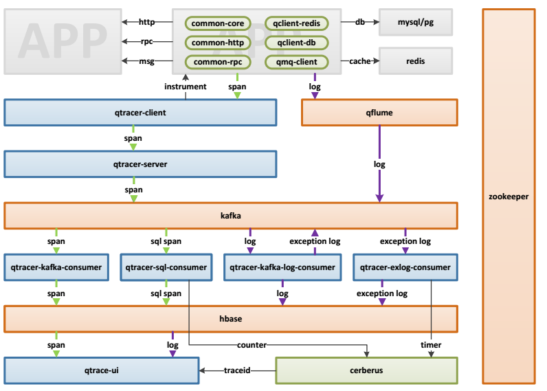

## Q_Trace  
分布式链路跟踪系统:
源于Google Dapper论文，一次完整的请求与响应构成一条完整的链路，中间各种服务的调用为子链路，每个链路抽象为一个span，拥有自己的spanId，所有的span通过唯一的traceId关联起来成为一条完整的调用链。

- 名词解释
  - span: 每个调用过程的描述（包括开始结束时间、请求内容描述等，不同请求有不同的span实现）
  - log: trace的日志（主要指应用/logs/目录下的日志文件），通过日志收集统一管理
  - instrument：采用java.lang.instrument实现无入侵式的埋点，使用ASM字节码增强技术来修改类定义（将方法添加进字节码文件）。通过instrument实现动态添加代理的方式（agentMain）实现无入侵式埋点
- 系统处理流程说明
  - 1.App即应用端（可以是浏览器、或其他系统）发起请求，公司的公共组件中内置了qtracer-client进行插桩并生成traceId和span
  - 2.公共组件规矩规则产生相关log，通过qflume自动收集
  - 3.qtracer-cient将span通过netty推送给qtracer-server，qtracer-server将日志推送到kafka
  - 4.span和log统一收集到consumer之后，不同的kafka-consumer按需拉取消息消费
  - 5.kafka-consumer将处理后的结果存入hbase，并通过qtrace-ui展示到前台
  - 6.qtracer-sql-consumer和qtracer-exlog-consumer将sql执行时长、日常日志数量推送给cerberus监控，最后也可以通过qtarce-ui进行关联展示
- 其他
  kafka（包括*-kafka-consumer）这一层，是由于每天产生trace太多导致hase写入瓶颈，所以增加kafka提供缓冲，减轻hbase压力
