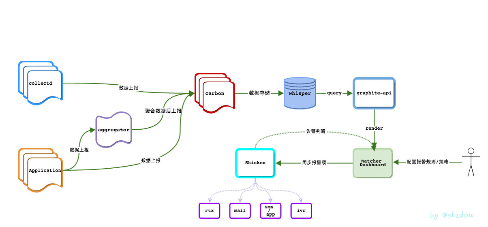
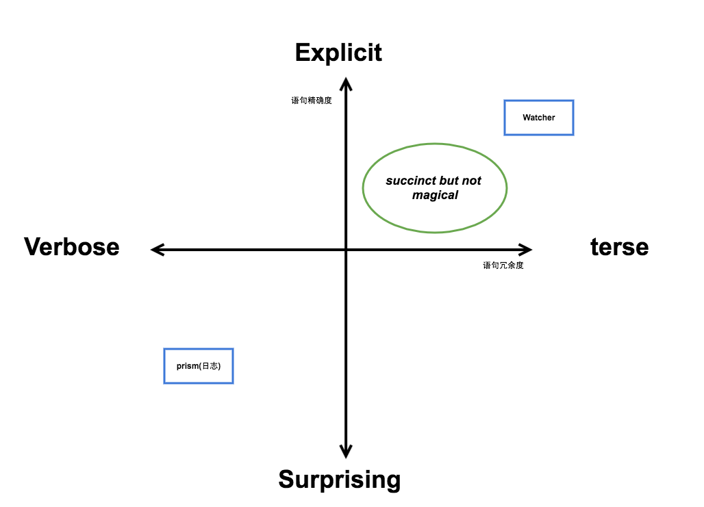

# Watcher
nagios+cacti

- collectd
  - collectd是部署在服务器上的一个daemon，用来收集系统级别监控数据，比如cpu、memory等指标。

- Graphite
  - Graphite是一个开源项目，基于Python，专注做两个事情:存储数字时间序列，并支持以丰富的函数获取数据，以图片或者json的格式。由三个组件组成:

    - Carbon - 负责接收数据
    - Whisper - 将收到的数据存储成whisper文件（类似RRD文件）
    - graphite-api - 支持Restful的URL获取图片或JSON数据，URL里可以带各种有用的函数

- Watcher Dashboard
  - 基于开源项目Grafana做二次开发，专注于以丰富的方式来实现对数字时间序列的可视化。

  ## 维度
  
