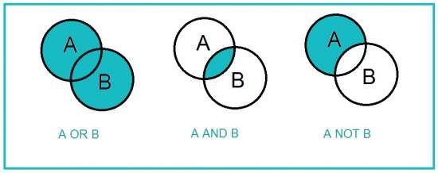
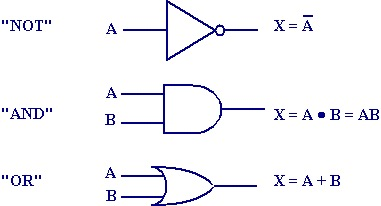

#布尔代数和计算机

#三段论
```
所有人都是要死的， 
苏格拉底是人，
所以，苏格拉底是要死的。
```
布尔代数就是用数学的方式来表示这种逻辑论断问题
#集合论

```
集合论表示三段论：
S（苏格拉底）,P（人类）,D （要死人）
S X (P X D)
= (S X P) X D
= S X D
= S

```
#集合运算规则
#布尔运行
```
交集（X）
1 X 1 = 1
1 X 0 = 0
0 X 0 = 0

并集（+）
1 + 1 = 1
1 + 0 = 1
0 + 0 = 0
```
#计算机

