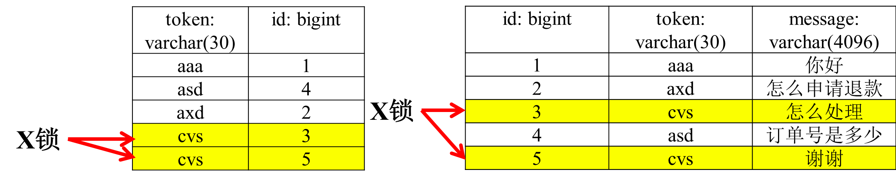
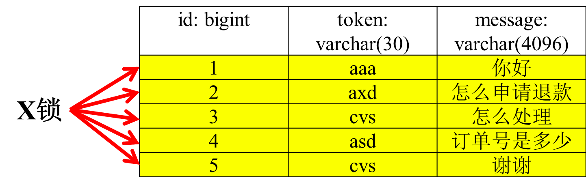
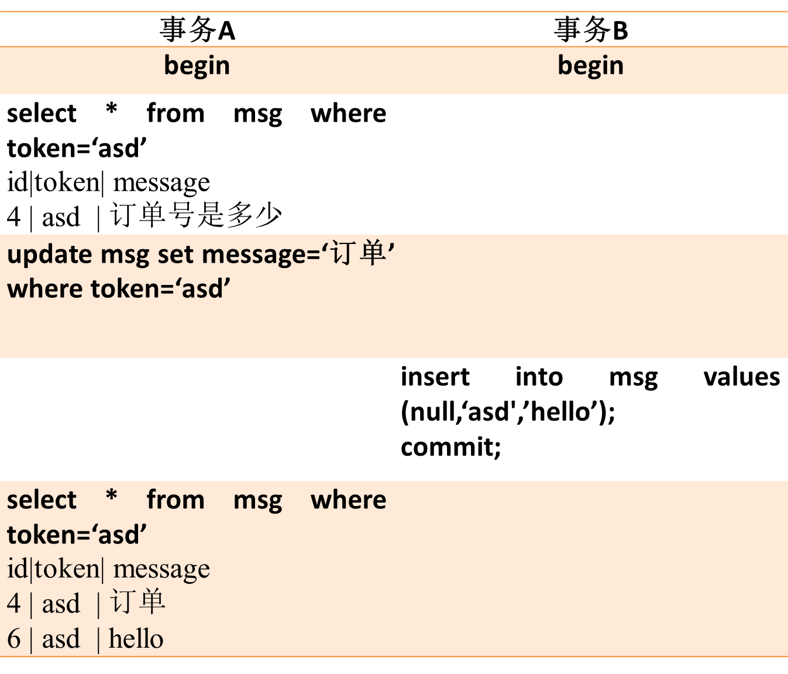
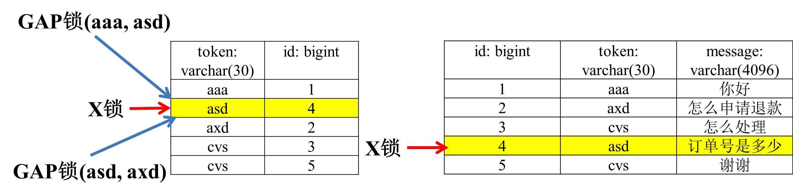
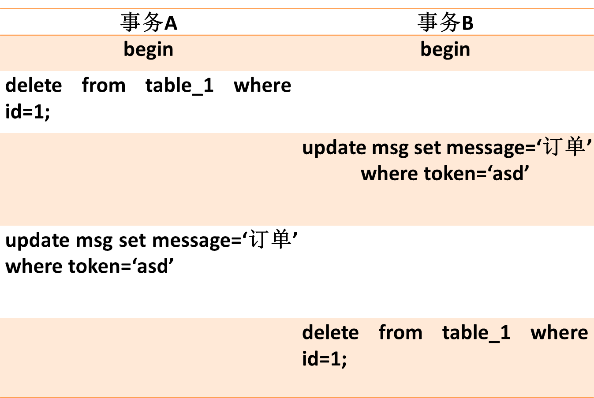
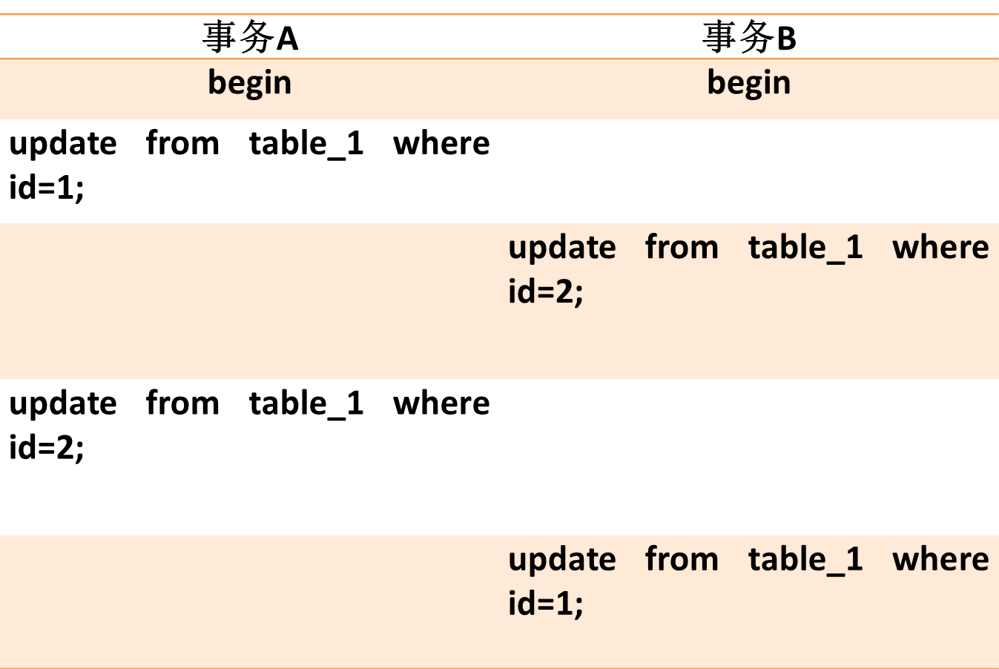
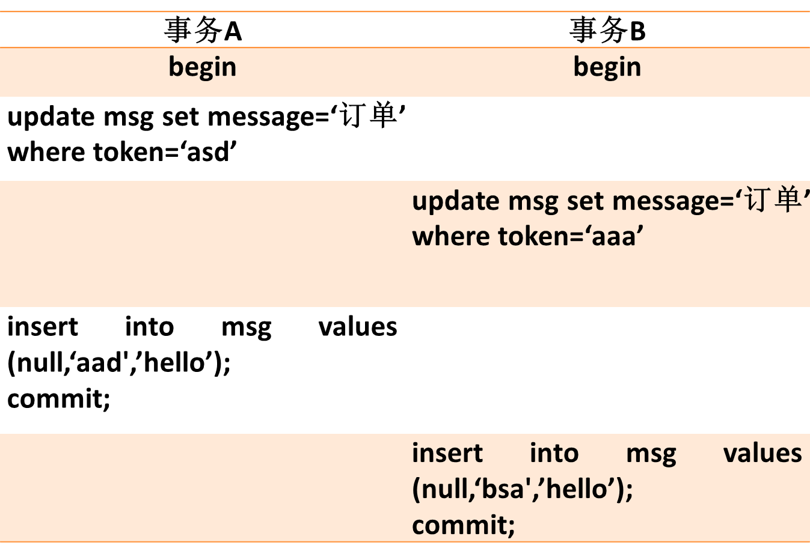

http://www.cnblogs.com/LBSer/p/5183300.html

# 锁和索引

 innodb对于主键使用了聚簇索引，这是一种数据存储方式，表数据是和主键一起存储，主键索引的叶结点存储行数据。对于普通索引，其叶子节点存储的是主键值。

1. delete from msg where id=2；

2. delete from msg where token=’ cvs’;

3. delete from msg where message=订单号是多少’；
 message没有索引，所以走的是全表扫描过滤。这时表上的各个记录都将添加上X锁。

# 幻读

## 解决这个幻读

   在事务A执行：update msg set message=‘订单’ where token=‘asd’;

   innodb首先会和RC级别一样，给索引上的记录添加上X锁，此外，还在非唯一索引’asd’与相邻两个索引的区间加上锁。

   这样，当事务B在执行insert into msg values (null,‘asd',’hello’); commit;时，会首先检查这个区间是否被锁上，如果被锁上，则不能立即执行，需要等待该gap锁被释放。这样就能避免幻读问题。

## 死锁成因

1. 不同表相同记录行锁冲突

这种情况很好理解，事务A和事务B操作两张表，但出现循环等待锁情况。

2. 相同表记录行锁冲突

这种情况比较常见，之前遇到两个job在执行数据批量更新时，jobA处理的的id列表为[1,2,3,4]，而job处理的id列表为[8,9,10,4,2]，这样就造成了死锁。

3. 不同索引锁冲突

 这种情况比较隐晦，事务A在执行时，除了在二级索引加锁外，还会在聚簇索引上加锁，在聚簇索引上加锁的顺序是[1,4,2,3,5]，而事务B执行时，只在聚簇索引上加锁，加锁顺序是[1,2,3,4,5]，这样就造成了死锁的可能性。

4.  gap锁

 innodb在RR级别下，如下的情况也会产生死锁，比较隐晦。不清楚的同学可以自行根据上节的gap锁原理分析下。
 
