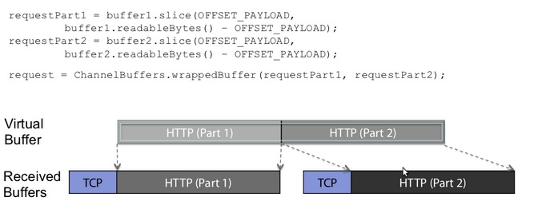
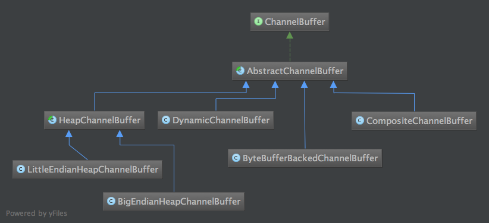

## Netty
*************
### netty_tcp
  
  - 这里可以看到，TCP层HTTP报文被分成了两个ChannelBuffer，这两个Buffer对我们上层的逻辑(HTTP处理)是没有意义的。但是两个ChannelBuffer被组合起来，就成为了一个有意义的HTTP报文，这个报文对应的ChannelBuffer，才是能称之为"Message"的东西。这里用到了一个词"Virtual Buffer"，也就是所谓的"Zero-Copy-Capable Byte Buffer"了。顿时觉得豁然开朗了有没有！
-
*********
#### ChanelBuffer

